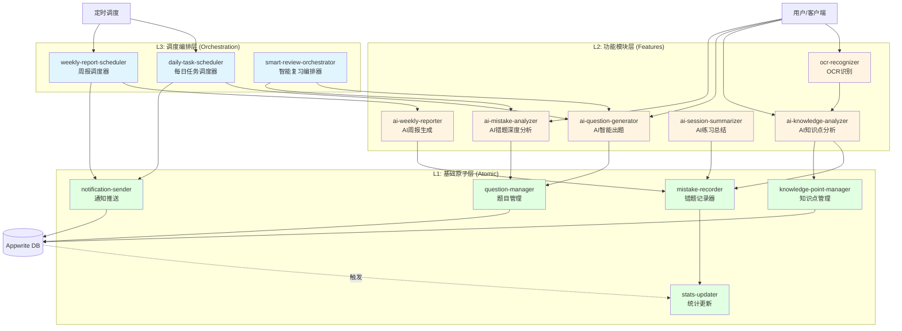

# 稳了！Appwrite Functions 设计文档 v2.0

## 设计原则

- **分层架构**：原子函数 → 功能模块 → 调度编排
- **职责单一**：每个函数只做一件事，可独立调用
- **可组合**：高级函数通过调用基础函数实现复杂功能
- **优雅现代**：使用Python async/await，类型注解
- **易于测试**：输入输出清晰，便于单元测试

---

## Functions 三层架构



---

## 分层设计说明

### 🟢 L1: 基础原子层 (Atomic Functions)
**特点**：
- 单一职责，CRUD操作
- 不依赖其他函数
- 快速执行（< 500ms）
- 可被任意上层函数调用

### 🟡 L2: 功能模块层 (Feature Functions)
**特点**：
- 完整的业务功能
- 可独立对外提供服务
- 可调用L1层函数
- 包含AI能力

### 🔵 L3: 调度编排层 (Orchestration Functions)
**特点**：
- 组合多个功能模块
- 实现复杂业务流程
- 处理定时任务
- 管理工作流

---

## 核心函数清单

## 🟢 L1: 基础原子层

### A1. **mistake-recorder** (错题记录器)

**功能**：创建和更新错题记录

**调用方式**：内部调用（Internal）

**接口**：
```python
async def create_mistake_record(
    user_id: str,
    question_id: str,
    knowledge_point_id: str,
    error_reason: str,
    user_answer: str = None,
    note: str = None,
    image_urls: list = []
) -> dict
```

---

### A2. **question-manager** (题目管理)

**功能**：题目的CRUD操作

**调用方式**：内部调用（Internal）

**接口**：
```python
async def create_question(question_data: dict) -> dict
async def get_question(question_id: str) -> dict
async def search_similar_questions(content: str, subject: str) -> list
async def update_question_quality(question_id: str, score: float) -> dict
```

---

### A3. **knowledge-point-manager** (知识点管理)

**功能**：知识点的创建、查找、更新

**调用方式**：内部调用（Internal）

**接口**：
```python
async def find_or_create_knowledge_point(
    user_id: str,
    subject: str,
    name: str,
    parent_id: str = None
) -> dict

async def update_knowledge_point_stats(
    kp_id: str,
    mistake_delta: int = 0,
    mastered_delta: int = 0
) -> dict
```

---

### A4. **stats-updater** (统计更新)

**功能**：响应数据库事件，自动更新统计

**触发方式**：数据库事件（Database Events）

**监听事件**：
- `mistake_records.*.create`
- `practice_answers.*.create`
- `mistake_records.*.update`

---

### A5. **notification-sender** (通知推送)

**功能**：统一的消息推送接口

**调用方式**：内部调用（Internal）

**接口**：
```python
async def send_notification(
    user_id: str,
    type: str,  # "daily_task" | "weekly_report" | "encouragement"
    title: str,
    body: str,
    data: dict = {}
) -> dict
```

---

## 🟡 L2: 功能模块层

### M1. **ocr-recognizer** (OCR识别) 🆕

**功能**：图片文字识别

**调用方式**：客户端调用 或 内部调用

**输入**：
```json
{
  "imageUrl": "https://...",
  "language": "zh-CN"
}
```

**输出**：
```json
{
  "text": "函数y=x²-2x+1的递减区间是？\nA. (-∞, 1)...",
  "confidence": 0.95,
  "blocks": [...]  // 文字块信息
}
```

**AI服务**：百度OCR / 讯飞OCR / Azure OCR

---

### M2. **ai-knowledge-analyzer** (AI知识点分析)

**功能**：
- 分析题目所属学科、知识点
- 判断题目类型和难度
- 建议知识点层级关系

**调用方式**：客户端调用 或 内部调用

**输入**：
```json
{
  "questionText": "函数y=x²-2x+1的递减区间是？",
  "subject": "math",  // 可选
  "userId": "user_xxx"
}
```

**输出**：
```json
{
  "subject": "math",
  "knowledgePoint": {
    "name": "二次函数增减区间",
    "level": 2,
    "parentName": "二次函数",
    "path": "函数 > 二次函数 > 增减区间"
  },
  "questionType": "choice",
  "difficulty": 3,
  "concepts": ["对称轴", "单调性", "二次函数图像"]
}
```

**AI服务**：GPT-4 / 通义千问 / 文心一言

---

### M3. **ai-question-generator** (AI智能出题) 🆕

**功能**：
- 基于原题生成变式题
- 基于知识点生成练习题
- 支持多种难度和题型

**调用方式**：客户端调用 或 内部调用

**输入场景1：基于原题生成变式**
```json
{
  "mode": "variant",
  "sourceQuestionId": "q_xxx",
  "count": 3,
  "difficultyAdjust": 0  // -1降低, 0相同, +1提高
}
```

**输入场景2：基于知识点生成**
```json
{
  "mode": "knowledge_point",
  "knowledgePointId": "ukp_xxx",
  "count": 5,
  "difficulty": 3,
  "questionTypes": ["choice", "fill_blank"]
}
```

**输入场景3：智能推荐生成**
```json
{
  "mode": "smart_recommend",
  "userId": "user_xxx",
  "subject": "math",
  "targetCount": 10
}
```

**输出**：
```json
{
  "questions": [
    {
      "id": "q_new_1",
      "subject": "math",
      "knowledgePointId": "ukp_xxx",
      "type": "choice",
      "difficulty": 3,
      "content": "函数y=x²-4x+3的递减区间是？",
      "options": ["(-∞, 2)", "[2, +∞)", "(-∞, 2]", "[2, +∞)"],
      "answer": "A",
      "explanation": "对称轴x=2，二次项系数为正...",
      "source": "ai_generated",
      "metadata": {
        "generatedFrom": "q_xxx",
        "generationMethod": "variant"
      }
    }
  ],
  "totalGenerated": 3
}
```

**AI服务**：GPT-4 / Claude / 通义千问

**核心能力**：
- 保持知识点一致性
- 数值/条件变化但解题思路相同
- 自动生成详细解析
- 质量评估打分

---

### M4. **ai-mistake-analyzer** (AI错题深度分析) 🆕

**功能**：
- 深度分析单道错题
- 诊断错误原因
- 提供针对性学习建议
- 生成个性化复习计划

**调用方式**：客户端调用

**输入**：
```json
{
  "mistakeRecordId": "mr_xxx",
  "includeHistory": true  // 是否包含历史错题分析
}
```

**输出**：
```json
{
  "mistakeAnalysis": {
    "errorType": "conceptual",  // conceptual/procedural/careless
    "rootCause": "对二次函数对称轴的理解不够深入",
    "missingKnowledge": [
      "二次函数对称轴公式 x=-b/2a",
      "对称轴与单调性的关系"
    ],
    "commonMistakes": "很多学生在此类题目中容易忽略...",
    "difficulty": "此题难度中等偏上，涉及..."
  },
  "learningPath": {
    "immediate": [
      "复习二次函数对称轴公式",
      "理解单调性与对称轴的关系"
    ],
    "practice": [
      "完成3道同类型变式题",
      "总结二次函数增减区间的判断步骤"
    ],
    "longTerm": "建议系统复习函数单调性章节"
  },
  "relatedMistakes": [
    {
      "mistakeRecordId": "mr_yyy",
      "knowledgePoint": "二次函数最值",
      "correlation": "high",
      "reason": "都涉及对称轴的理解"
    }
  ],
  "encouragement": "这类题目确实有一定难度，但你已经掌握了基础计算，只需要加强对称轴概念的理解就能突破！",
  "nextSteps": "建议先完成3道变式题巩固，然后尝试挑战稍难的综合题"
}
```

**AI服务**：GPT-4 (需要强大的推理能力)

**调用场景**：
- 用户点击错题详情页的"AI深度分析"按钮
- 练习会话结束后自动生成
- 周报中针对重点错题的分析

---

### M5. **ai-session-summarizer** (AI练习总结)

**功能**：
- 分析练习会话结果
- 生成AI总结和鼓励
- 更新错题掌握状态

**调用方式**：客户端调用

**输入**：
```json
{
  "sessionId": "ps_xxx"
}
```

**输出**：
```json
{
  "summary": {
    "overall": "本次练习共完成3道题，正确2道，正确率67%",
    "strengths": ["计算准确", "解题步骤清晰"],
    "weaknesses": ["对称轴概念理解不够"],
    "progress": "相比上次练习，准确率提升了15%"
  },
  "encouragement": "进步很明显！继续保持这个节奏，二次函数你很快就能完全掌握了！",
  "suggestions": [
    "建议重点复习对称轴相关知识点",
    "可以尝试画图辅助理解单调性"
  ],
  "updatedMistakes": ["mr_1", "mr_2"],
  "masteryImprovement": {
    "二次函数增减区间": "+20%"
  }
}
```

---

### M6. **ai-weekly-reporter** (AI周报生成)

**功能**：
- 聚合本周学习数据
- AI生成个性化周报
- 提供学习建议和计划

**调用方式**：内部调用 (被O2调用)

**输入**：
```json
{
  "userId": "user_xxx",
  "weekStart": "2025-10-21",
  "weekEnd": "2025-10-27"
}
```

**输出**：
```json
{
  "statistics": {
    "totalMistakes": 8,
    "totalPracticeSessions": 5,
    "practiceCompletionRate": 80,
    "overallAccuracy": 65,
    "studyTimeMinutes": 180
  },
  "topMistakePoints": [
    {
      "name": "二次函数增减区间",
      "count": 3,
      "accuracy": 50
    }
  ],
  "errorReasonDistribution": {
    "conceptUnclear": 50,
    "logicBlocked": 30,
    "careless": 20
  },
  "aiSummary": "本周你在函数章节遇到了一些挑战，主要集中在二次函数的单调性判断上。好消息是，你的练习完成率很高，说明学习态度很积极。通过本周5次练习，你的掌握率已经从30%提升到50%，进步明显！",
  "strengths": [
    "学习态度认真，练习完成率高",
    "基础计算能力强",
    "善于通过练习巩固知识"
  ],
  "improvements": [
    "概念理解需要加强，特别是对称轴和单调性的关系",
    "可以尝试更多变式题来加深理解"
  ],
  "nextWeekPlan": {
    "focus": "二次函数增减区间",
    "targetAccuracy": 80,
    "suggestedPracticeCount": 10,
    "milestones": [
      "理解对称轴公式",
      "掌握单调性判断方法",
      "完成5道变式题"
    ]
  },
  "encouragement": "你的进步速度很快！继续保持这个节奏，下周你一定能突破这个难点！💪"
}
```

---

## 🔵 L3: 调度编排层

### O1. **daily-task-scheduler** (每日任务调度器)

**功能**：
- 分析用户需复习的错题
- 调用M3生成变式题
- 创建每日任务
- 推送通知

**触发方式**：定时任务（每天凌晨2:00）

**执行流程**：
```python
async def generate_daily_tasks():
    active_users = await get_active_users()
    
    for user in active_users:
        # 1. 分析需要复习的错题
        mistakes = await analyze_review_needs(user.id)
        if not mistakes:
            continue
        
        # 2. 调用M3智能生成题目
        questions = await call_function("ai-question-generator", {
            "mode": "smart_recommend",
            "userId": user.id,
            "targetCount": 5,
            "basedOnMistakes": [m.id for m in mistakes]
        })
        
        # 3. 创建每日任务
        task = await create_daily_task(user.id, questions)
        
        # 4. 调用A5推送通知
        await call_function("notification-sender", {
            "userId": user.id,
            "type": "daily_task",
            "title": "今日复盘任务已准备好",
            "body": f"为你准备了{len(questions)}道练习题"
        })
```

---

### O2. **weekly-report-scheduler** (周报调度器)

**功能**：
- 聚合本周数据
- 调用M6生成AI周报
- 创建周报记录
- 推送通知

**触发方式**：定时任务（每周日晚上20:00）

**执行流程**：
```python
async def generate_weekly_reports():
    active_users = await get_active_users()
    
    for user in active_users:
        # 1. 获取本周时间范围
        week_range = get_current_week_range()
        
        # 2. 调用M6生成AI周报
        report = await call_function("ai-weekly-reporter", {
            "userId": user.id,
            "weekStart": week_range.start,
            "weekEnd": week_range.end
        })
        
        # 3. 创建周报记录
        await create_weekly_report(user.id, report)
        
        # 4. 推送通知
        await call_function("notification-sender", {
            "userId": user.id,
            "type": "weekly_report",
            "title": "本周学习报告已生成",
            "body": report["aiSummary"][:50] + "..."
        })
```

---

### O3. **smart-review-orchestrator** (智能复习编排器) 🆕

**功能**：
- 分析用户学习状态
- 智能推荐复习内容
- 生成个性化复习计划
- 可被客户端主动调用

**触发方式**：客户端调用

**输入**：
```json
{
  "userId": "user_xxx",
  "reviewType": "quick" | "thorough" | "exam_prep",
  "targetTime": 30,  // 期望学习时长（分钟）
  "subject": "math"  // 可选
}
```

**输出**：
```json
{
  "reviewPlan": {
    "totalQuestions": 8,
    "estimatedMinutes": 30,
    "focusAreas": [
      {
        "knowledgePoint": "二次函数增减区间",
        "priority": "high",
        "questionCount": 3,
        "reason": "近期错误率高，需重点复习"
      },
      {
        "knowledgePoint": "函数图像",
        "priority": "medium",
        "questionCount": 2,
        "reason": "已有一定掌握，巩固提升"
      }
    ],
    "questions": [...],  // 调用M3生成
    "learningStrategy": "建议先复习概念，再做题巩固"
  },
  "mistakeAnalysis": {
    "criticalMistakes": [...],  // 调用M4分析
    "patternFound": "你在函数单调性题目上经常卡壳"
  }
}
```

**执行流程**：
```python
async def orchestrate_smart_review(user_id, review_type, target_time, subject):
    # 1. 分析用户薄弱知识点
    weak_points = await analyze_weak_points(user_id, subject)
    
    # 2. 对关键错题调用M4深度分析
    critical_mistakes = await get_critical_mistakes(user_id, weak_points)
    analyses = []
    for mistake in critical_mistakes[:3]:  # 最多分析3道
        analysis = await call_function("ai-mistake-analyzer", {
            "mistakeRecordId": mistake.id
        })
        analyses.append(analysis)
    
    # 3. 调用M3智能生成复习题目
    questions = await call_function("ai-question-generator", {
        "mode": "smart_recommend",
        "userId": user_id,
        "subject": subject,
        "targetTime": target_time,
        "focusPoints": [wp.id for wp in weak_points]
    })
    
    # 4. 生成复习计划
    return create_review_plan(weak_points, questions, analyses)
```

---

## 函数调用关系示例

### 场景1：用户拍照识别错题（完整流程）

```
客户端上传图片 → Storage
    ↓
客户端调用 M1: ocr-recognizer
    ↓ (返回文字)
客户端调用 M2: ai-knowledge-analyzer
    ↓ (返回知识点信息)
M2 内部调用:
    → A3: knowledge-point-manager (创建/查找知识点)
    → A2: question-manager (创建题目)
    → A1: mistake-recorder (创建错题记录)
    ↓ (触发数据库事件)
A4: stats-updater (自动更新统计)
```

### 场景2：用户点击"AI深度分析"

```
客户端调用 M4: ai-mistake-analyzer
    ↓
M4 查询:
    → 错题详情 (mistake_record)
    → 题目内容 (question)
    → 历史错题 (相关)
    ↓
AI 分析生成报告
    ↓
返回分析结果给客户端
```

### 场景3：用户开始"智能复习"

```
客户端调用 O3: smart-review-orchestrator
    ↓
O3 编排流程:
    → 分析用户薄弱点
    → 调用 M4 分析关键错题
    → 调用 M3 智能生成题目
    → 组装复习计划
    ↓
返回完整复习方案给客户端
```

### 场景4：每日任务自动生成

```
定时触发 (凌晨2:00)
    ↓
O1: daily-task-scheduler
    ↓
O1 编排流程:
    → 查询所有活跃用户
    → 分析每个用户的复习需求
    → 调用 M3 智能生成题目
    → 创建 daily_task 记录
    → 调用 A5 推送通知
```

---

## Functions 技术栈

| 层级 | Function | 语言 | 主要依赖 | 说明 |
|------|----------|------|----------|------|
| **L1** | mistake-recorder | Python 3.12 | appwrite | 错题CRUD |
| **L1** | question-manager | Python 3.12 | appwrite | 题目CRUD |
| **L1** | knowledge-point-manager | Python 3.12 | appwrite | 知识点CRUD |
| **L1** | stats-updater | Python 3.12 | appwrite | 统计更新 |
| **L1** | notification-sender | Python 3.12 | appwrite | 消息推送 |
| **L2** | ocr-recognizer | Python 3.12 | baidu-ocr / azure | OCR识别 |
| **L2** | ai-knowledge-analyzer | Python 3.12 | openai, appwrite | AI知识点分析 |
| **L2** | ai-question-generator | Python 3.12 | openai, appwrite | AI智能出题 |
| **L2** | ai-mistake-analyzer | Python 3.12 | openai, appwrite | AI错题深度分析 |
| **L2** | ai-session-summarizer | Python 3.12 | openai, appwrite | AI练习总结 |
| **L2** | ai-weekly-reporter | Python 3.12 | openai, appwrite | AI周报生成 |
| **L3** | daily-task-scheduler | Python 3.12 | appwrite | 每日任务调度 |
| **L3** | weekly-report-scheduler | Python 3.12 | appwrite | 周报调度 |
| **L3** | smart-review-orchestrator | Python 3.12 | appwrite | 智能复习编排 |

**为什么选Python**：
- Appwrite官方支持良好
- AI SDK（OpenAI等）Python生态最成熟
- 代码简洁，开发效率高
- 异步支持完善（asyncio）

---

## 开发优先级

### Phase 1: 基础设施（MVP）
**目标**：建立基础CRUD能力，支持手动录入错题

| 优先级 | Function | 层级 | 说明 |
|--------|----------|------|------|
| 1 | question-manager | L1 | 题目CRUD（先支持手动创建） |
| 2 | knowledge-point-manager | L1 | 知识点CRUD |
| 3 | mistake-recorder | L1 | 错题记录 |
| 4 | stats-updater | L1 | 统计自动更新 |
| 5 | ai-knowledge-analyzer | L2 | AI知识点分析（简化版） |

### Phase 2: AI核心能力
**目标**：实现智能出题和错题分析

| 优先级 | Function | 层级 | 说明 |
|--------|----------|------|------|
| 6 | ai-question-generator | L2 | 智能出题（变式题生成） |
| 7 | ai-session-summarizer | L2 | 练习总结 |
| 8 | ai-mistake-analyzer | L2 | 错题深度分析 |
| 9 | notification-sender | L1 | 通知推送 |

### Phase 3: 自动化调度
**目标**：实现每日任务和周报自动生成

| 优先级 | Function | 层级 | 说明 |
|--------|----------|------|------|
| 10 | daily-task-scheduler | L3 | 每日任务自动生成 |
| 11 | ai-weekly-reporter | L2 | AI周报生成 |
| 12 | weekly-report-scheduler | L3 | 周报自动调度 |

### Phase 4: 高级功能
**目标**：智能复习和OCR识别

| 优先级 | Function | 层级 | 说明 |
|--------|----------|------|------|
| 13 | smart-review-orchestrator | L3 | 智能复习编排 |
| 14 | ocr-recognizer | L2 | OCR图片识别 |
| 15 | - | - | AI模型微调和优化 |

---

## 安全与性能

### 安全
- ✅ 所有函数需验证 `userId` 权限
- ✅ API Key存储在环境变量
- ✅ 敏感操作记录审计日志
- ✅ 限流：每个用户每天最多识别50道错题

### 性能
- ✅ 异步处理，避免阻塞
- ✅ 定时任务批量处理，减少数据库查询
- ✅ AI调用失败重试机制（最多3次）
- ✅ 长时任务使用队列（未来考虑）

### 监控
- 函数执行时间、成功率
- AI调用消耗（token数）
- 错误日志告警

---

## 环境变量配置

每个函数需要的环境变量：

```bash
# 通用
APPWRITE_ENDPOINT=https://cloud.appwrite.io/v1
APPWRITE_PROJECT_ID=xxx
APPWRITE_API_KEY=xxx

# AI相关
OPENAI_API_KEY=xxx
OPENAI_MODEL=gpt-4o  # 或 gpt-3.5-turbo

# OCR相关（可选多个供应商）
BAIDU_OCR_API_KEY=xxx
BAIDU_OCR_SECRET_KEY=xxx

# 通知相关（未来）
WECHAT_APPID=xxx
WECHAT_SECRET=xxx
```

---

## 快速参考表

### Functions 完整清单

| 层级 | 函数名 | 触发方式 | 功能概述 | 调用场景 |
|------|--------|----------|----------|----------|
| **L1** | mistake-recorder | 内部调用 | 创建和更新错题记录 | 被M2调用 |
| **L1** | question-manager | 内部调用 | 题目CRUD操作 | 被M2, M3调用 |
| **L1** | knowledge-point-manager | 内部调用 | 知识点创建、查找、更新 | 被M2调用 |
| **L1** | stats-updater | 数据库事件 | 自动更新统计数据 | 数据变化触发 |
| **L1** | notification-sender | 内部调用 | 统一消息推送接口 | 被O1, O2调用 |
| **L2** | ocr-recognizer | 客户端/内部 | OCR图片文字识别 | 拍照识别 |
| **L2** | ai-knowledge-analyzer | 客户端/内部 | AI分析知识点 | 录入错题 |
| **L2** | ai-question-generator | 客户端/内部 | AI智能出题（变式/推荐） | 举一反三、每日任务 |
| **L2** | ai-mistake-analyzer | 客户端 | AI错题深度分析 | 错题详情、智能复习 |
| **L2** | ai-session-summarizer | 客户端 | AI练习会话总结 | 练习完成 |
| **L2** | ai-weekly-reporter | 内部调用 | AI生成周报 | 被O2调用 |
| **L3** | daily-task-scheduler | 定时任务 | 每日任务自动生成 | 凌晨2:00 |
| **L3** | weekly-report-scheduler | 定时任务 | 周报自动生成 | 周日20:00 |
| **L3** | smart-review-orchestrator | 客户端 | 智能复习编排 | 用户主动复习 |

### AI能力使用清单

| Function | 使用的AI能力 | AI模型建议 | Token消耗估算 |
|----------|--------------|-----------|--------------|
| ai-knowledge-analyzer | 文本分析、分类 | GPT-3.5/通义千问 | ~300 tokens/次 |
| ai-question-generator | 题目生成 | GPT-4/Claude | ~1000 tokens/次 |
| ai-mistake-analyzer | 深度推理、分析 | GPT-4 | ~2000 tokens/次 |
| ai-session-summarizer | 总结生成 | GPT-3.5/通义千问 | ~500 tokens/次 |
| ai-weekly-reporter | 数据分析、总结 | GPT-4 | ~1500 tokens/次 |

### 函数调用依赖图

```
L3 (编排层)
  ├─ daily-task-scheduler
  │    ├─ 调用 → ai-question-generator (M3)
  │    └─ 调用 → notification-sender (A5)
  │
  ├─ weekly-report-scheduler
  │    ├─ 调用 → ai-weekly-reporter (M6)
  │    └─ 调用 → notification-sender (A5)
  │
  └─ smart-review-orchestrator
       ├─ 调用 → ai-mistake-analyzer (M4)
       └─ 调用 → ai-question-generator (M3)

L2 (功能层)
  ├─ ocr-recognizer (独立，不调用其他函数)
  │
  ├─ ai-knowledge-analyzer
  │    ├─ 调用 → knowledge-point-manager (A3)
  │    ├─ 调用 → question-manager (A2)
  │    └─ 调用 → mistake-recorder (A1)
  │
  ├─ ai-question-generator
  │    └─ 调用 → question-manager (A2)
  │
  ├─ ai-mistake-analyzer (独立，仅查询数据库)
  │
  ├─ ai-session-summarizer
  │    └─ 调用 → mistake-recorder (A1) - 更新掌握状态
  │
  └─ ai-weekly-reporter (独立，仅查询和聚合数据)

L1 (原子层)
  ├─ mistake-recorder (直接操作数据库)
  ├─ question-manager (直接操作数据库)
  ├─ knowledge-point-manager (直接操作数据库)
  ├─ stats-updater (数据库触发器，直接操作数据库)
  └─ notification-sender (调用Appwrite Messaging API)
```

---

## 总结

### 三层架构，14个函数，完整覆盖所有业务场景

#### 🟢 L1: 基础原子层（5个函数）
提供基础CRUD能力，被上层函数调用
- `mistake-recorder` - 错题记录
- `question-manager` - 题目管理
- `knowledge-point-manager` - 知识点管理
- `stats-updater` - 统计更新
- `notification-sender` - 通知推送

#### 🟡 L2: 功能模块层（6个函数）
完整的业务功能，可独立对外服务
- `ocr-recognizer` - OCR识别
- `ai-knowledge-analyzer` - AI知识点分析
- `ai-question-generator` - **AI智能出题** ⭐
- `ai-mistake-analyzer` - **AI错题深度分析** ⭐
- `ai-session-summarizer` - AI练习总结
- `ai-weekly-reporter` - AI周报生成

#### 🔵 L3: 调度编排层（3个函数）
组合功能模块，实现复杂业务流程
- `daily-task-scheduler` - 每日任务调度
- `weekly-report-scheduler` - 周报调度
- `smart-review-orchestrator` - **智能复习编排** ⭐

### 核心业务场景映射

| 业务场景 | 调用路径 |
|----------|----------|
| 拍照识别错题 | M1(OCR) → M2(知识点分析) → A1/A2/A3(创建记录) |
| 手动录入错题 | M2(知识点分析) → A1/A2/A3(创建记录) |
| 智能出题 | M3(AI出题) → A2(保存题目) |
| 错题深度分析 | M4(AI分析) |
| 完成练习 | M5(AI总结) → A1(更新掌握状态) |
| 每日任务 | O1 → M3 → A5 |
| 周报生成 | O2 → M6 → A5 |
| 智能复习 | O3 → M4 + M3 |

### 设计亮点 🌟

1. **分层清晰**
   - 原子层不依赖其他函数，快速可靠
   - 功能层可独立调用或被编排
   - 编排层实现复杂工作流

2. **可组合**
   - 高级函数通过调用基础函数实现复杂功能
   - 避免重复代码，提高复用性

3. **智能化**
   - AI贯穿全流程：识别 → 出题 → 分析 → 总结
   - 两大核心AI能力：智能出题 + 错题深度分析

4. **易扩展**
   - 新增功能只需添加L2函数
   - 新增业务流程只需添加L3编排函数

5. **高性能**
   - L1函数快速响应（< 500ms）
   - 数据库触发器自动更新统计
   - 异步调用提高吞吐量

### 与产品功能对应

| 产品功能 | Functions支持 |
|----------|---------------|
| 拍照识别错题 | M1 + M2 |
| 错因选择 | M2（AI建议错因） |
| 知识点错题集 | A3 + A4（自动统计） |
| 举一反三 | M3（智能出题） |
| 每日任务 | O1（自动生成） |
| 智能复盘 | M4 + O3 |
| 周报 | M6 + O2 |

---

**文档版本**：v2.0  
**更新时间**：2025-10-29  
**架构**：三层分层架构（L1原子层 + L2功能层 + L3编排层）

