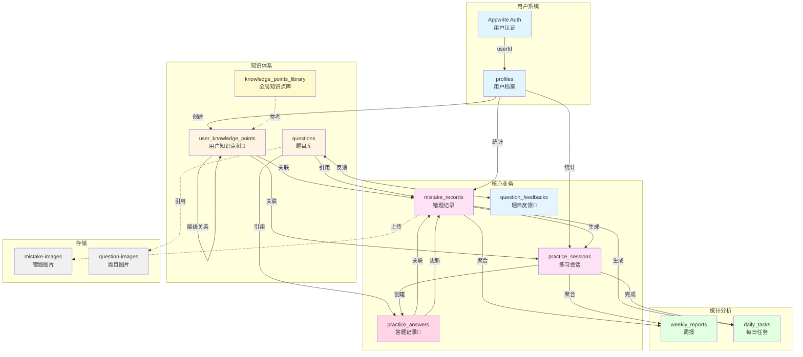
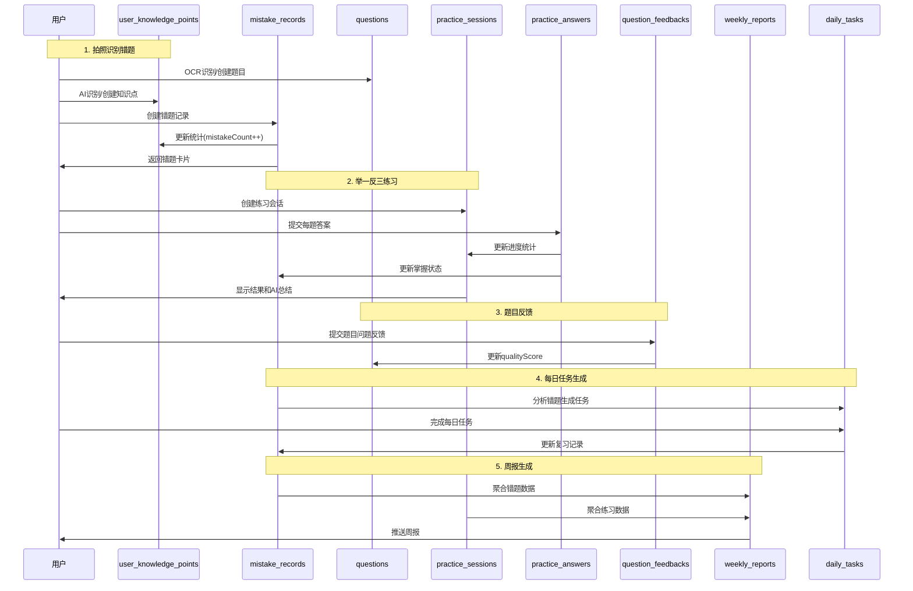

# 稳了！数据库结构示意图 v2.0

## 整体架构图



## 核心数据流



## Collection 详细结构

### 用户相关

```
┌─────────────────────────────┐
│   profiles (用户档案)        │
├─────────────────────────────┤
│ • userId (→ Auth)           │
│ • name                      │
│ • grade                     │
│ • focusSubjects []          │
│ • totalMistakes             │
│ • masteredMistakes          │
│ • continuousDays            │
└─────────────────────────────┘
```

### 知识体系

```
┌─────────────────────────────────────┐
│ knowledge_points_library (全局库)    │
├─────────────────────────────────────┤
│ • subject                           │
│ • name                              │
│ • parentId (自关联)                 │
│ • level                             │
│ • aliases [] (别名)                 │
│ • usageCount (被引用次数)            │
│ • isVerified (是否审核)             │
└─────────────────────────────────────┘
         │ (供AI识别参考)
         ↓
┌─────────────────────────────────────┐        ┌─────────────────────────────┐
│ user_knowledge_points (用户知识点树) │        │   questions (题目库)         │
├─────────────────────────────────────┤        ├─────────────────────────────┤
│ • userId                            │        │ • subject                   │
│ • subject                           │◄───────│ • knowledgePointId          │
│ • name                              │        │ • type                      │
│ • parentId (自关联)                 │        │ • difficulty                │
│ • level                             │        │ • content                   │
│ • mistakeCount (统计)               │        │ • answer                    │
│ • masteredCount (统计)              │        │ • explanation               │
│ • createdFrom (user/ai/import)      │        │ • source (ocr/generated)    │
└─────────────────────────────────────┘        │ • createdBy (用户ID)        │
         ▲                                     │ • isPublic                  │
         │                                     │ • qualityScore              │
         └─────────────────────────────────────┤ • feedbackCount             │
            (parentId 层级关系)                 └─────────────────────────────┘
                                                         │
                                                         │ (质量反馈)
                                                         ↓
                                               ┌─────────────────────────────┐
                                               │ question_feedbacks (反馈)    │
                                               ├─────────────────────────────┤
                                               │ • questionId                │
                                               │ • feedbackType              │
                                               │ • description               │
                                               │ • status                    │
                                               └─────────────────────────────┘
```

### 核心业务

```
┌─────────────────────────────────────────────┐
│    mistake_records (错题记录)                │
├─────────────────────────────────────────────┤
│ • userId                                    │
│ • questionId (→ questions)                  │
│ • userKnowledgePointId (→ user_kp)          │
│ • subject                                   │
│ • errorReason                               │
│ • masteryStatus                             │
│   ├─ notStarted                             │
│   ├─ practicing                             │
│   └─ mastered                               │
│ • reviewCount                               │
│ • correctCount                              │
│ • originalImageUrls []                      │
│ • lastReviewAt                              │
└─────────────────────────────────────────────┘
         │
         │ (答题时更新掌握状态)
         ▲
         │
┌─────────────────────────────────────────────┐
│   practice_sessions (练习会话)               │
├─────────────────────────────────────────────┤
│ • userId                                    │
│ • type (dailyReview/mistakeDrill...)        │
│ • userKnowledgePointId                      │
│ • title / subtitle                          │
│ • totalQuestions (总题数)                    │
│ • completedQuestions (已完成)                │
│ • correctQuestions (正确数)                  │
│ • status (in_progress/completed/abandoned)  │
│ • aiSummary (AI总结)                        │
└─────────────────────────────────────────────┘
         │
         │ (创建答题记录)
         ▼
┌─────────────────────────────────────────────┐
│   practice_answers (答题记录)                │
├─────────────────────────────────────────────┤
│ • userId                                    │
│ • sessionId (→ practice_sessions)           │
│ • questionId (→ questions)                  │
│ • mistakeRecordId (→ mistake_records)       │
│ • userAnswer                                │
│ • isCorrect                                 │
│ • timeSpent (答题用时)                       │
│ • answeredAt                                │
└─────────────────────────────────────────────┘
```

### 统计分析

```
┌─────────────────────────────────────────┐
│      weekly_reports (周报)               │
├─────────────────────────────────────────┤
│ • userId                                │
│ • weekStart ~ weekEnd                   │
│ • totalMistakes                         │
│ • totalPracticeSessions                 │
│ • practiceCompletionRate                │
│ • overallAccuracy                       │
│ • topMistakePoints [] (JSON)            │
│ • errorReasonDistribution [] (JSON)     │
│ • aiSummary                             │
│ • suggestions []                        │
└─────────────────────────────────────────┘

┌─────────────────────────────────────────┐
│      daily_tasks (每日任务)              │
├─────────────────────────────────────────┤
│ • userId                                │
│ • taskDate                              │
│ • questionIds [] (→ questions)          │
│ • taskType                              │
│ • isCompleted                           │
│ • completedAt                           │
└─────────────────────────────────────────┘
```

## 业务场景映射

### 场景1：学生拍照错题

```
用户拍照 
  ↓
OCR识别 (云函数: ocr-recognition)
  ↓
AI识别知识点 → 查找/创建 user_knowledge_point
  ↓
创建/匹配 question (记录 createdBy)
  ↓
创建 mistake_record (关联 userKnowledgePointId)
  ↓
更新 user_knowledge_point.mistakeCount++
  ↓
更新 profile.totalMistakes++
```

### 场景2：错题地图展示

```
查询 user_knowledge_points (按 userId + subject)
  ↓
构建知识点树形结构 (根据 parentId)
  ↓
查询 mistake_records 统计数据
  ↓
返回知识点统计 (mistakeCount, masteredCount)
  ↓
前端绘制气泡图 (气泡大小 = mistakeCount)
```

### 场景3：举一反三练习

```
用户选择错题/知识点
  ↓
生成变式题 (云函数: generate-variants)
  ↓
创建 practice_session (status=in_progress)
  ↓
用户答题 → 创建 practice_answer
           → 更新 practice_session 统计
  ↓
答题完成 → practice_session.status = completed
         → AI生成总结 (aiSummary)
         → 根据 practice_answers 更新 mistake_records.masteryStatus
  ↓
更新 profile.totalPracticeSessions++
```

### 场景3.1：题目反馈

```
用户发现题目问题
  ↓
创建 question_feedback (status=pending)
  ↓
管理员审核
  ↓
处理：修改题目 / 删除题目 / 拒绝反馈
  ↓
更新 question.qualityScore
```

### 场景4：每日任务生成

```
定时任务 (每天凌晨)
  ↓
查询 mistake_records (未掌握 + 需复习)
  ↓
生成变式题 (云函数: daily-task-gen)
  ↓
创建 daily_task
  ↓
推送通知给用户
```

### 场景5：周报生成

```
定时任务 (每周日晚)
  ↓
聚合 mistake_records (本周数据)
  ↓
聚合 practice_sessions (本周数据)
  ↓
AI分析生成总结 (云函数: weekly-report-gen)
  ↓
创建 weekly_report
  ↓
推送通知给用户
```

## 索引策略

### 高频查询索引

```
user_knowledge_points:
  ✓ userId + subject                    → 用户学科知识点
  ✓ userId + parentId                   → 构建知识点树
  ✓ userId + name                       → 知识点搜索
  ✓ userId + lastMistakeAt              → 最近错题排序

mistake_records:
  ✓ userId + $createdAt (DESC)          → 错题列表
  ✓ userId + subject                    → 学科错题
  ✓ userId + userKnowledgePointId       → 知识点错题
  ✓ userId + masteryStatus              → 掌握状态筛选

practice_sessions:
  ✓ userId + startedAt (DESC)           → 练习历史
  ✓ userId + status                     → 状态筛选
  ✓ userId + type                       → 练习类型筛选

practice_answers:
  ✓ sessionId                           → 会话答题记录
  ✓ userId + answeredAt                 → 用户答题历史
  ✓ mistakeRecordId                     → 错题关联答题

question_feedbacks:
  ✓ questionId                          → 题目反馈列表
  ✓ userId + $createdAt                 → 用户反馈历史
  ✓ status                              → 待处理反馈

knowledge_points_library:
  ✓ subject + level                     → 分层查询
  ✓ subject + name                      → 搜索
  ✓ name (fulltext)                     → 全文搜索

daily_tasks:
  ✓ userId + taskDate (UNIQUE)          → 今日任务
  
weekly_reports:
  ✓ userId + weekStart (UNIQUE)         → 周报查询
```

## 数据量估算

### 单用户年度数据（预估）

```
user_knowledge_points: ~30 条 (逐步积累)
mistake_records:       ~500 条/年
practice_sessions:     ~200 条/年
practice_answers:      ~600 条/年 (平均每次练习3题)
question_feedbacks:    ~10 条/年
daily_tasks:          ~365 条/年
weekly_reports:        ~52 条/年
───────────────────────────────────
总计:                ~1,757 条/年
```

### 存储容量估算

```
单条错题记录:        ~2 KB
单个练习会话:        ~1 KB (简化后)
单条答题记录:        ~0.5 KB
单张错题图片:        ~500 KB (压缩后)

1000个活跃用户/年:
  - 文档数据:      ~1.5 GB
  - 图片数据:      ~250 GB
```

## v2.0 核心改进

### 1. 用户知识点树 🌳
- 每个用户拥有自己的知识点树（`user_knowledge_points`）
- 随着错题记录动态构建
- 全局知识点库（`knowledge_points_library`）作为AI识别参考

### 2. 练习与答题分离 📝
- `practice_sessions` 只存储练习会话元信息
- `practice_answers` 独立存储每次答题记录
- 职责清晰，查询高效

### 3. 题目反馈机制 💬
- `question_feedbacks` 收集用户反馈
- 影响题目 `qualityScore`
- 支持审计和持续改进

---

## 扩展性设计

### 已实现的扩展性

1. ✅ **用户知识点树**：支持个性化学习路径
2. ✅ **练习答题分离**：便于详细分析学习行为
3. ✅ **题目反馈机制**：支持众包审计和质量提升
4. ✅ **题目来源追踪**：支持OCR、AI生成、手动创建
5. ✅ **知识点来源标记**：区分用户、AI、导入来源

### 未来可扩展的方向

1. **班级功能** → 新增 `classes` collection
2. **教师端** → 新增 `teachers` collection  
3. **成就系统** → 新增 `achievements` collection
4. **社交功能** → 新增 `follows`, `comments` collection
5. **知识点共享** → user_knowledge_points 支持分享和导入
6. **题目市场** → questions.isPublic 支持用户贡献题库

### 元数据字段预留

多个表包含 `metadata` JSON字段，可灵活存储扩展数据。

---

## 图例说明

- **实线箭头** (→): 直接引用关系
- **虚线箭头** (⇢): 间接关联或聚合
- 🌳 用户知识点树（新）
- 📝 答题记录分离（新）
- 💬 题目反馈机制（新）
- **蓝色**: 用户系统
- **黄色**: 知识体系
- **粉色**: 核心业务
- **绿色**: 统计分析
- **灰色**: 存储系统

---

*最后更新：2025-10-29*
*版本：v2.0*

